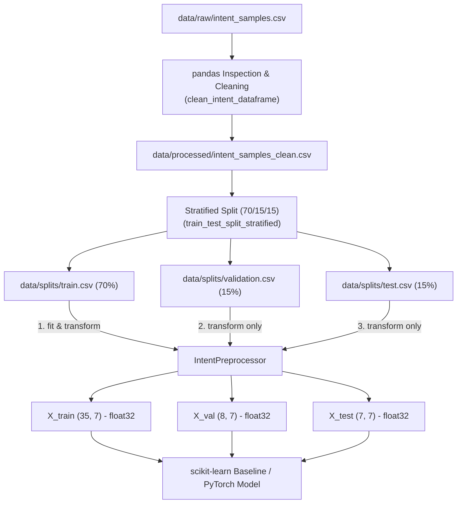

# Data Pipeline & Feature Engineering (Month 02)

Tài liệu này ghi nhận kiến trúc pipeline xử lý dữ liệu, chiến lược phân tách (split), hợp đồng tiền xử lý (preprocessing contract), checklist phòng chống rò rỉ dữ liệu (data leakage) và cơ chế kiểm thử khói (smoke test) cho project `ai-assistant-platform`.

---

## 1. Tổng quan Kiến trúc Data Pipeline

Dữ liệu thô (raw data) dạng văn bản không thể đưa trực tiếp vào các mô hình Machine Learning hoặc Neural Network dạng số. Pipeline dữ liệu đảm nhiệm chuyển đổi dữ liệu từ dạng bảng/văn bản sang ma trận số (`ndarray`) với schema chặt chẽ, tách bạch ranh giới giữa huấn luyện và đánh giá.



---

## 2. Nền tảng NumPy: Shape, Dtype và Vectorization

### 2.1 Ma trận Đặc trưng `X` (2D Array)
Trong Machine Learning chuẩn, ma trận dữ liệu đầu vào $X$ luôn có dạng 2 chiều (2D array):
- **`shape` = `(N, D)`**:
  - `N` (trục `axis=0`): Số lượng mẫu quan sát (samples / rows).
  - `D` (trục `axis=1`): Số lượng đặc trưng (features / columns).
- **`ndim` = 2**: Số chiều của mảng.
- **`nbytes`**: Dung lượng bộ nhớ thực tế của mảng liên tục (contiguous memory buffer).

### 2.2 Vai trò của `dtype`
- **Numeric Dtype (`float32`, `int32`, `float64`)**: Cung cấp cấu trúc mảng đồng nhất (homogeneous), lưu trữ các số nhị phân liên tiếp trong RAM, cho phép tận dụng SIMD (Single Instruction, Multiple Data) của CPU/GPU.
- **Tại sao tránh `object` dtype?**: Kiểu `object` trong NumPy thực chất là mảng chứa các con trỏ trỏ tới Python object nằm rải rác trong bộ nhớ (pointer chasing). Điều này làm mất khả năng vector hóa phần cứng, gây overhead bộ nhớ lớn và khiến các thư viện như scikit-learn hoặc PyTorch báo lỗi hoặc chạy chậm gấp hàng chục lần.

### 2.3 Vectorization và Trục (Axis)
- **Vectorization**: Thay vì dùng vòng lặp Python (`for` loop) chậm chạp qua từng phần tử, vectorization thực hiện phép toán đồng thời trên toàn bộ mảng ở tầng mã máy C/Fortran.
- **Khái niệm `axis` trong tính toán thống kê**:
  - `axis=0` (Dọc theo các hàng): Thống kê đặc trưng trên toàn bộ dataset (ví dụ: `np.mean(X, axis=0)` trả về vector 1D kích thước `(D,)` là giá trị trung bình của từng cột feature).
  - `axis=1` (Ngang qua các cột): Thống kê trên từng dòng quan sát (ví dụ: tổng điểm của từng sample).
- **Boolean Masking**: Lọc dữ liệu tốc độ cao không qua vòng lặp, ví dụ `is_question = X[:, 2] == 1.0` tạo ra mảng boolean mask dùng để trích xuất hoặc đếm `np.sum(is_question)`.

---

## 3. Đặc trưng Văn bản Cơ bản (Baseline Text Features)

Ở giai đoạn baseline (Ngày 30), hệ thống trích xuất 3 đặc trưng số học cơ bản từ cột `text` trước khi sử dụng các phương pháp phức tạp hơn như TF-IDF hay Embedding:

| Index | Tên Feature | Mô tả | Kiểu Dữ liệu |
|---|---|---|---|
| 0 | `text_length` | Độ dài của câu tính theo số ký tự (`len(text)`) | `int32` $\rightarrow$ scaled `float32` |
| 1 | `word_count` | Số lượng từ trong câu (`len(text.split())`) | `int32` $\rightarrow$ scaled `float32` |
| 2 | `has_question_mark` | Cờ nhị phân (1 nếu có `?`, 0 nếu không) | `int32` $\rightarrow$ scaled `float32` |

Kết hợp cùng One-Hot Encoding cho cột categorical `source` (ví dụ: `app_desktop`, `phone`, `web_ui`), tổng số cột đặc trưng $D = 3 + 4 = 7$ cột.

---

## 4. Hợp đồng Làm sạch Dữ liệu (Cleaning Contract)

Hàm `clean_intent_dataframe(df)` trong [`src/ai_assistant_platform/ml/preprocessing.py`](file:///e:/repos/cilel1/ai-assistant-platform/src/ai_assistant_platform/ml/preprocessing.py) thiết lập các chuẩn mực bắt buộc:

1. **Chuẩn hóa văn bản**: Cắt bỏ khoảng trắng thừa (`strip()`) ở cả hai đầu câu `text` và nhãn `intent`.
2. **Chuẩn hóa nhãn**: Chuyển toàn bộ nhãn `intent` về chữ thường (`lower()`).
3. **Loại bỏ bản ghi rỗng**: Loại bỏ các dòng có `text` rỗng/None (`dropna(subset=['text'])`) và `intent` rỗng/None (`dropna(subset=['intent'])`).
4. **Loại bỏ trùng lặp hoàn toàn**: Loại bỏ các dòng bị trùng lặp toàn bộ các cột (`drop_duplicates()`).
5. **Audit Summary**: Trả về từ điển tổng kết số lượng dòng bị loại bỏ ở từng khâu phục vụ logging và audit dữ liệu.

---

## 5. Chiến lược Phân chia Dữ liệu (Stratified Split 70/15/15)

Dữ liệu sau khi làm sạch được phân tách thành 3 tập riêng biệt:

- **Train Set (70%)** - `data/splits/train.csv` (35 mẫu): Dùng để huấn luyện trọng số mô hình và học các tham số tiền xử lý (`fit`).
- **Validation Set (15%)** - `data/splits/validation.csv` (8 mẫu): Dùng để kỹ sư ML đánh giá mô hình trong quá trình phát triển, tinh chỉnh siêu tham số (hyperparameters), và chọn mô hình tốt nhất.
- **Test Set (15%)** - `data/splits/test.csv` (7 mẫu): Dùng để đánh giá độc lập khách quan lần cuối trước khi đóng gói sản phẩm.

### Yêu cầu Kỹ thuật
- **Tính tái lập (Reproducibility)**: Cố định `random_state=42` ở mọi lệnh chia.
- **Bảo toàn tỷ lệ nhãn (Stratification)**: Sử dụng `stratify=df['intent']` để tỷ lệ từng loại intent ở tập train, val và test đều tương đồng nhau, tránh class imbalance ngẫu nhiên.
- **Tính cô lập (Disjoint)**: Không có bất kỳ mẫu `text` nào trùng lặp giữa các tập (`set(train) ∩ set(test) = ∅`).

---

## 6. Hợp đồng Fit / Transform Boundary & Phòng chống Data Leakage

Rò rỉ dữ liệu (Data Leakage) xảy ra khi thông tin từ tập Test hoặc Validation bị vô tình đưa vào quá trình huấn luyện, dẫn đến mô hình đạt độ chính xác ảo trên bài test nhưng thất bại thảm hại khi triển khai thực tế.

### 6.1 Bảng Ranh giới Tiền xử lý (Boundary Contract)

| Thao tác | Tập Train | Tập Validation | Tập Test | Giải thích |
|---|---|---|---|---|
| **Fit Scaler** ($\mu, \sigma$) | **Có** | **CẤM** | **CẤM** | Chỉ tính trung bình và phương sai trên Train. Nếu tính trên Test là rò rỉ phân bố tương lai. |
| **Fit Encoder** (Categories) | **Có** | **CẤM** | **CẤM** | Chỉ học danh sách danh mục từ Train. Gặp giá trị mới ở Val/Test phải xử lý bằng `handle_unknown='ignore'`. |
| **Transform** | **Có** | **Có** | **Có** | Dùng nguyên bộ tham số đã học từ Train để biến đổi Val và Test sang ma trận số. |

### 6.2 Data Leakage Checklist

- [x] **Scaling / Normalization Leakage**: Tuyệt đối không gọi `StandardScaler.fit()` trên toàn bộ dataset trước khi split. Luôn split trước, chỉ fit scaler trên `train_df`.
- [x] **Duplicate Text Leakage**: Đã kiểm tra giao nhau `set(train_text) ∩ set(test_text) == ∅`. Không để cùng một câu văn bản xuất hiện ở cả hai tập.
- [x] **Target / Label Leakage**: Các đặc trưng đầu vào chỉ tính toán thuần túy từ văn bản thô (`len`, `word_count`, `?`) và kênh gửi (`source`). Không sử dụng bất kỳ trường nào sinh ra sau khi intent đã được gán nhãn.
- [x] **Unseen Intent Leakage**: Tập Validation và Test không được phép chứa nhãn `intent` mà tập Train chưa từng học (`test_intents.issubset(train_intents)`).
- [x] **Điều cấm kỵ với Test Set**:
  - **KHÔNG** dùng Test set để chọn kiến trúc mô hình.
  - **KHÔNG** dùng Test set để tối ưu hóa siêu tham số (hyperparameters).
  - **KHÔNG** dùng Test set để tìm ngưỡng phân loại tối ưu (classification threshold).
  - Test set chỉ được mở ra đánh giá **đúng một lần duy nhất** khi mô hình đã đóng băng.

---

## 7. Cơ chế Kiểm thử Khói Pipeline (Pipeline Smoke Test)

Script kiểm tra: [`scripts/check_data_pipeline.py`](file:///e:/repos/cilel1/ai-assistant-platform/scripts/check_data_pipeline.py)

### 7.1 Mục đích
Smoke test là bài kiểm thử tích hợp nhanh toàn diện, chạy trên luồng chính từ file CSV split đến ma trận đặc trưng cuối cùng, đảm bảo dữ liệu sẵn sàng 100% cho các bài toán học máy mà không phát sinh lỗi tiềm ẩn.

### 7.2 Bốn Bài Kiểm tra Ma trận (Matrix Assertions)
1. **Kiểm tra số cột ($D$)**: Số cột đặc trưng của $X_{train}, X_{val}, X_{test}$ phải bằng nhau ($D=7$). Đảm bảo phép nhân ma trận $W \cdot X$ không bị crash.
2. **Kiểm tra số dòng ($N$)**: Số dòng của $X_{train}, X_{val}, X_{test}$ phải khớp chính xác với số dòng ban đầu của `df_train` (35), `df_validate` (8), `df_test` (7). Tuyệt đối không làm rơi rớt dòng.
3. **Kiểm tra kiểu dữ liệu (`dtype`)**: Phải là `np.float32` đồng nhất để tương thích với GPU/CPU vectorization và PyTorch tensors.
4. **Kiểm tra giá trị hợp lệ**: Tuyệt đối không chứa `NaN` (Not a Number) hoặc `Inf` (Infinity) bằng kiểm tra `np.isfinite(X).all()`.

### 7.3 Lệnh Chạy Kiểm chứng
```powershell
uv run python scripts/check_data_pipeline.py
uv run python -m pytest tests/unit -q
uv run ruff check .
```

---

## 8. Tự kiểm tra Kiến thức (Self-Check Q&A)

### Q1: Feature nào có thể chứa label trá hình (Target Leakage)?
> **Trả lời:** Target leakage xảy ra khi một đặc trưng đầu vào chứa thông tin chỉ xuất hiện *sau* khi kết quả đã xảy ra, hoặc có tương quan nhân quả ngược với nhãn. Ví dụ:
> - Cột `action_status` (ví dụ: "meeting_created") xuất hiện trong log khi người dùng yêu cầu tạo lịch họp.
> - Cột `response_duration` hoặc `target_service_id` chỉ được hệ thống gán vào sau khi bộ định tuyến phân loại xong intent.
> Nếu đưa các feature này vào, mô hình sẽ đạt accuracy 100% khi học nhưng hoàn toàn vô dụng trên Production vì lúc người dùng gửi tin nhắn đến, những thông tin đó chưa hề tồn tại.

### Q2: Vì sao test set không dùng để chọn threshold?
> **Trả lời:** Ngưỡng phân loại (classification threshold, ví dụ quyết định xác suất $\ge 0.7$ mới kích hoạt intent) là một **siêu tham số (hyperparameter)**. Nếu dùng Test set để dò tìm ngưỡng tối ưu (chọn ngưỡng cho F1-score cao nhất trên test set), ta đã gián tiếp để mô hình "học vẹt" theo phân bố cụ thể của tập test đó (Data Snooping). Ngưỡng phân loại bắt buộc phải được điều chỉnh trên tập **Validation**, sau đó giữ cố định ngưỡng này khi đánh giá trên tập **Test**.

### Q3: Smoke test khác unit test thế nào?
> **Trả lời:**
> - **Unit Test**: Đi sâu kiểm tra tính đúng đắn của từng hàm/class cô lập với dữ liệu giả lập (mock data) và các trường hợp biên nhỏ (edge cases như chuỗi rỗng, None).
> - **Smoke Test**: Là bài kiểm tra "sống còn" tích hợp chạy từ đầu đến cuối luồng (End-to-End nhẹ) trên dữ liệu thật, kiểm tra xem toàn bộ các mắt xích ráp lại có hoạt động trôi chảy, không bị crash, không rò rỉ dữ liệu và cho ra ma trận hợp lệ hay không trước khi tốn tài nguyên chạy huấn luyện thật.
